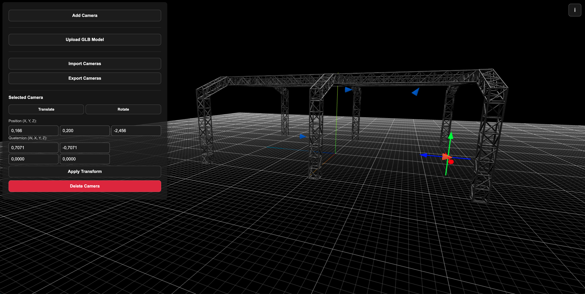

# COLMAP Rig - Three.js Editor

A powerful Three.js-based tool for visualizing and editing camera rigs for COLMAP. This interactive editor allows you to manipulate cameras using intuitive gizmos, import/export configurations, and use GLB models as visual references.



## Features

### Camera Management
- ✅ **Add/Delete Cameras**: Create and remove camera objects in the 3D scene
- ✅ **Interactive Gizmos**: Translation (arrows) and rotation (rings) controls
- ✅ **Precise Form Input**: Manual entry of position and quaternion values
- ✅ **Visual Selection**: Click cameras to select and edit them

### GLB Model Support
- ✅ **Upload GLB/GLTF Models**: Load 3D models as visual references
- ✅ **Full Transform Control**: Translate, rotate, and scale GLB models
- ✅ **Interactive Manipulation**: Use gizmos to transform models in real-time
- ✅ **Model Management**: Select, edit, and delete GLB models

### Import/Export
- ✅ **Export rig_config.json**: Save camera configurations for COLMAP
- ✅ **Import rig_config.json**: Load existing camera setups
- ✅ **COLMAP Compatibility**: Direct integration with COLMAP workflows

### User Interface
- ✅ **Intuitive Controls**: Easy-to-use panel with clear instructions
- ✅ **Real-time Updates**: Immediate visual feedback for all changes
- ✅ **Keyboard Shortcuts**: T (translate), R (rotate), S (scale for models)
- ✅ **Dark Theme**: Professional dark interface for better focus

## Installation

1. Clone the repository:
   ```bash
   git clone https://github.com/pdxmusic/colmap-rig-threejs-editor.git
   ```

2. Navigate to the project directory:
   ```bash
   cd colmap-rig-threejs-editor
   ```

3. Install dependencies:
   ```bash
   npm install
   ```

## Usage

1. Start the development server:
   ```bash
   npm run dev
   ```

2. Open your browser and navigate to:
   ```
   http://localhost:5173
   ```

## How to Use

### Basic Workflow

1. **Load Reference Model (Optional)**:
   - Click "Upload GLB Model" to load a 3D model for visual reference
   - Position and scale the model as needed

2. **Import Existing Configuration (Optional)**:
   - Click "Import rig_config.json" to load an existing camera setup
   - This will replace all current cameras with those from the file

3. **Add Cameras**:
   - Click "Add Camera" to create new camera objects
   - Cameras appear as blue cone shapes pointing in the Z+ direction

4. **Edit Cameras**:
   - Click on any camera to select it
   - Use gizmos or the control panel to adjust position and rotation
   - **T** key or button: Translation mode (colored arrows)
   - **R** key or button: Rotation mode (colored rings)

5. **Edit GLB Models**:
   - Click on any GLB model to select it
   - Use gizmos or the control panel to transform the model
   - **T** key: Translation mode
   - **R** key: Rotation mode  
   - **S** key: Scale mode (GLB models only)

6. **Export Configuration**:
   - Click "Export rig_config.json" to save camera positions
   - The exported file is compatible with COLMAP rig workflows

### Controls

- **Mouse**: Click to select objects, drag gizmos to transform
- **Orbit**: Right-click + drag to orbit around the scene
- **Zoom**: Mouse wheel to zoom in/out
- **Pan**: Middle-click + drag to pan the view

### Keyboard Shortcuts

- **T**: Switch to Translation mode
- **R**: Switch to Rotation mode
- **S**: Switch to Scale mode (GLB models only)

## File Formats

### Export Format (rig_config.json)
```json
{
  "rigs": [
    {
      "cameras": [
        {
          "camera_id": 1,
          "T_cam_rig": [x, y, z],
          "Q_cam_rig": [w, x, y, z]
        }
      ]
    }
  ]
}
```

### Supported 3D Models
- **.glb** (Binary GLTF)
- **.gltf** (Text GLTF)

## Technical Details

- **Renderer**: Three.js WebGL
- **Controls**: OrbitControls for scene navigation
- **Gizmos**: Custom-built translation, rotation, and scale gizmos
- **Shadows**: Real-time shadow mapping enabled
- **Grid**: Metric grid system (1m main grid, 0.1m sub-grid)

## Development

Built with:
- **Three.js** - 3D graphics library
- **Vite** - Build tool and dev server
- **Modern JavaScript** - ES6+ modules

## License

This project is licensed under the MIT License. See the LICENSE file for details.

## Contributing

Contributions are welcome! Please feel free to submit a Pull Request.
